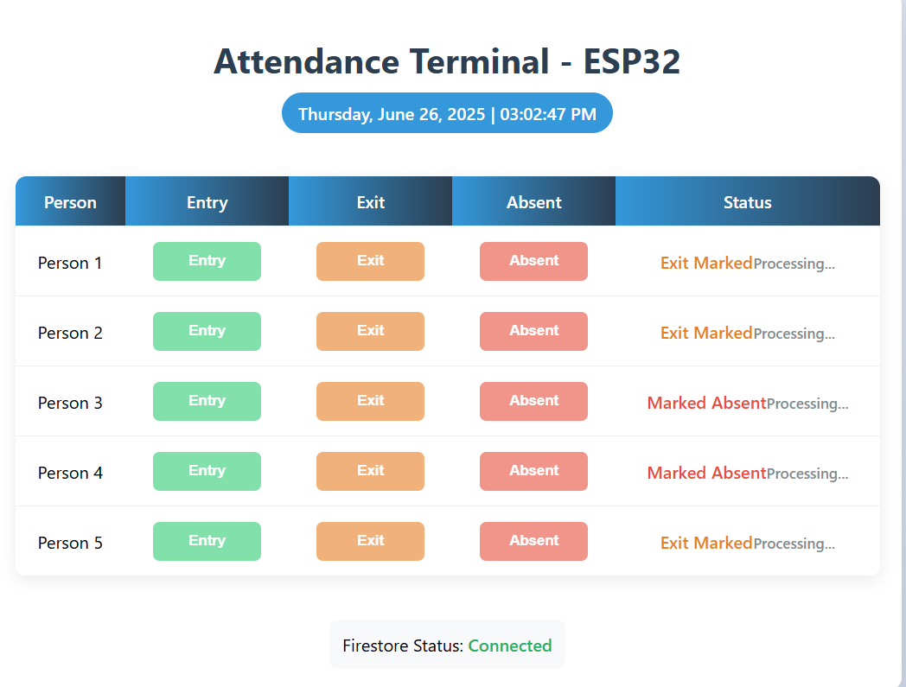
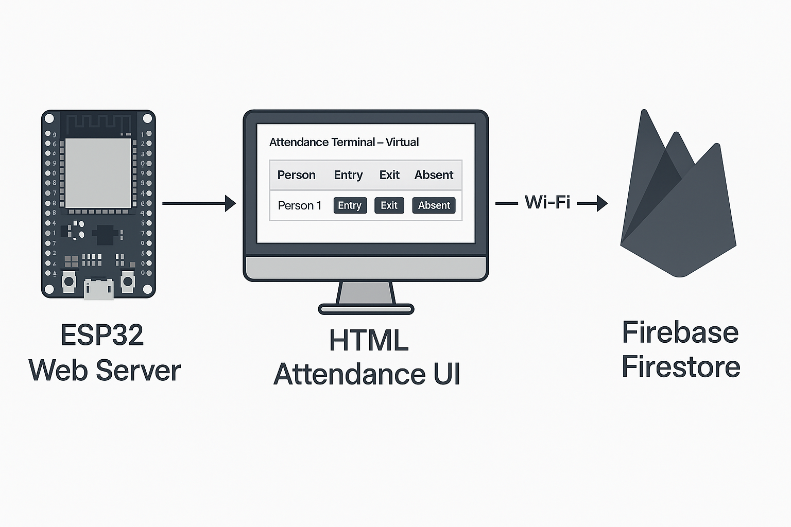
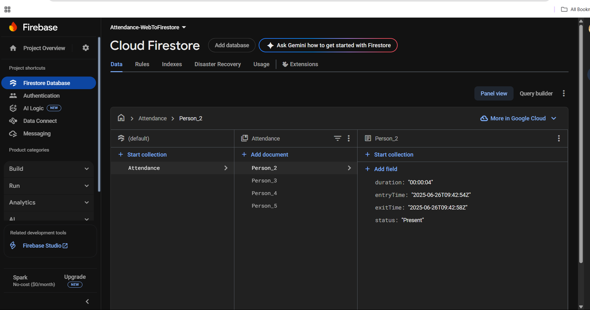

# ESP32 Virtual Attendance System Using Cloud Firestore and HTML

This is a cloud-connected attendance system built using **ESP32**, **Firebase Firestore**, and **PlatformIO (VS Code)**. It allows tracking of daily **entry**, **exit**, and **absence** status for up to 5 individuals via a custom web interface hosted on the ESP32.

---
## Tech Stack

- **Board**: ESP32 DevKit v1
- **Platform**: PlatformIO (VS Code)
- **Language**: C/C++
- **Cloud Backend**: Firebase Firestore (NoSQL)
- **Network**: WiFi (NTPClient for time sync)
- **Web Interface**: HTML hosted by ESP32

---

## Project Features

- Entry, Exit, and Absent buttons for 5 individuals
- Real-time timestamp and status storage on Firebase
- Calculates duration (between entry and exit)
- Prevents multiple entries or exits on the same day
- Hosted HTML UI served via ESP32
- Works completely wirelessly on local WiFi

---
## How It Works
1. ESP32 connects to WiFi and Firebase using API key.
2. Web interface displays buttons for each person.
3. When a button is pressed (Entry/Exit/Absent), the ESP32:
   - Gets current timestamp via NTP
   - Writes data to Firestore (under a nested map for each person)
4. Data includes status (entry/exit/absent), time, and duration (for exit).

---
## Firestore Data Structure
/Attendance/
   Person1/
      {status: "entry"--
       time: "2025-07-07 10:30:00"--
       duration: "2h 45m" (only for exit) }

##  Future Improvements
- Add biometric sensor (Fingerprint/RFID)
- User authentication
- Firebase Cloud Functions for alerts

##  Screenshot / Circuit Diagram

```Markdown
[](Images/UI_Web_Interface.png)
[](Images/data_flow.png)
[](Images/Cloud_Firestore_data_storage.png)
[](https://travis-ci.org/adam-p/markdown-here)
[](https://upload.wikimedia.org/wikipedia/commons/3/32/Arduino_Uno_-_R3.jpg)


